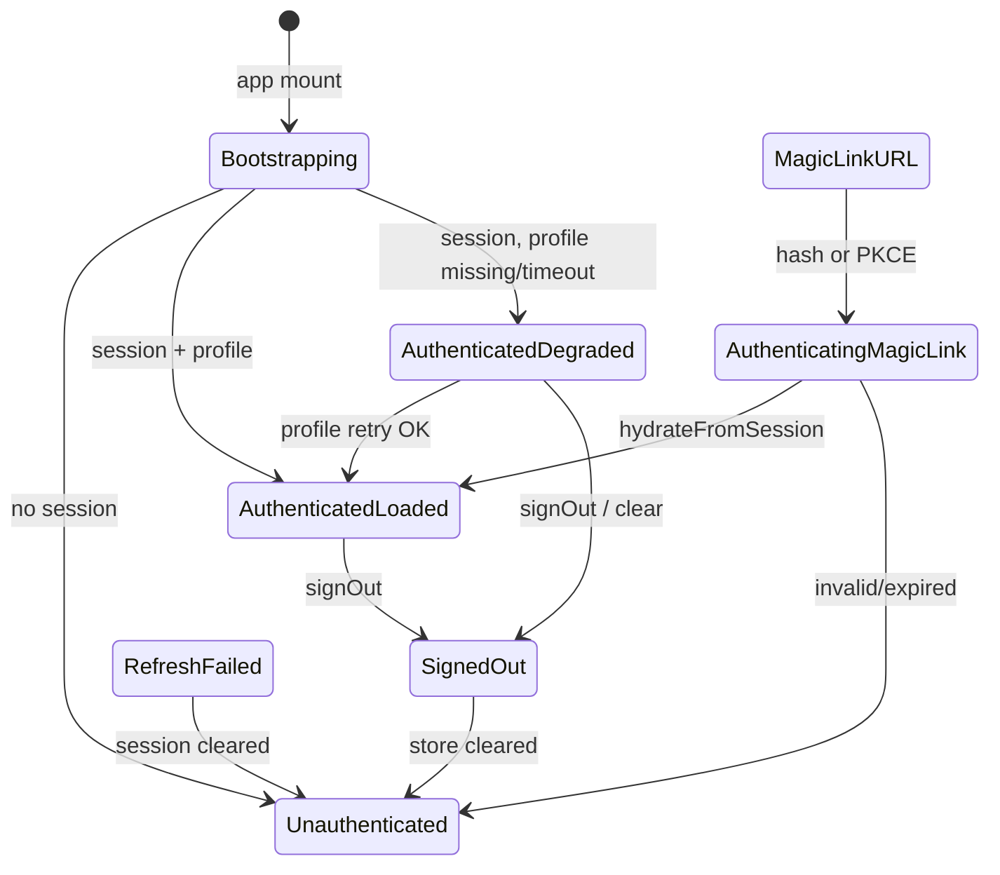
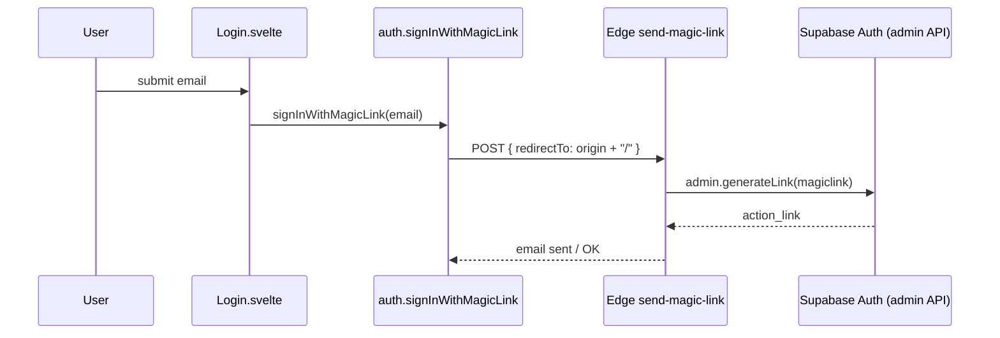
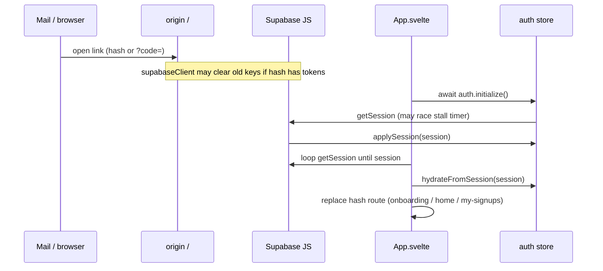
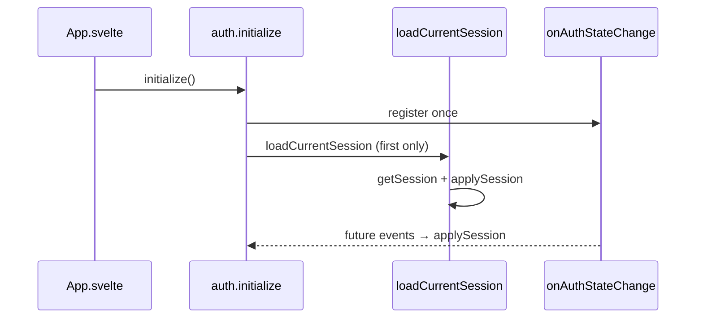
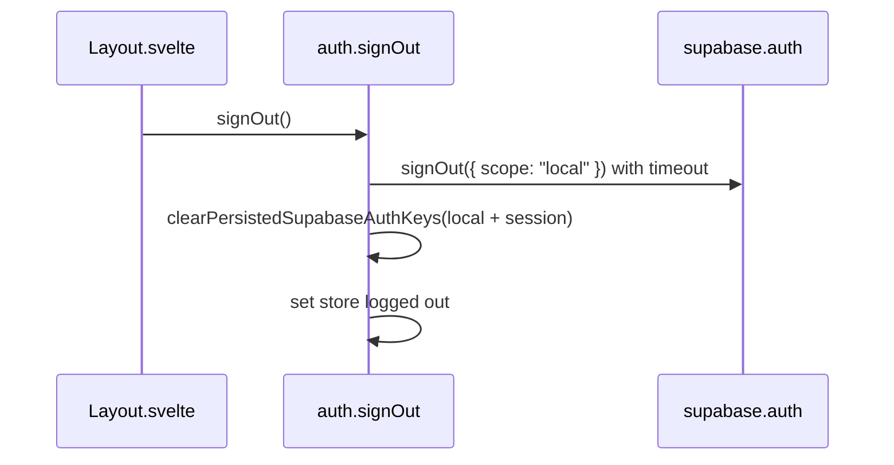

# Berkeley Omnium Volunteer Hub — architecture

Living document for how the app is put together. Update this as we change behavior or add features.

## Stack (summary)

- **Frontend:** Svelte 5, Vite, `svelte-spa-router` (hash routes).
- **Backend / data:** Supabase (Auth, Postgres, Row Level Security, Edge Functions).
- **State:** Svelte stores (`src/lib/stores/`), notably `auth` and domain-specific stores (`roles`, `signups`, etc.).
- **Entry:** `src/App.svelte` mounts the router inside `Layout`, and bootstraps Supabase Auth on mount.

---

## Strengths of the current auth doc (why it helps)

The auth section intentionally avoids pretending the app uses a formal enum: **several states are inferred** from `{ user, profile, loading, isAdmin }`, URL fragments, and timing. That matches the code.

- It separates **authenticated + profile loaded** from **authenticated but degraded**—both can look “logged in,” but operationally they differ (nav vs RLS vs admin).
- **Magic-link processing** is called out as a transient, high-bug-surface phase.
- **Refresh failed** is described as a **failure path** that usually collapses to unauthenticated, not a durable store mode.
- **Bootstrap timeout** is documented so readers do not treat auth init as atomic.

---

## State machine of app auth states

Auth is centered on the **`auth` store** (`src/lib/stores/auth.js`): `{ user, profile, loading, isAdmin }`. The store does not encode every phase as a separate enum; several **user-facing states** are implied by combinations of those fields plus **URL/time** behavior. Below is the mental model we use when reasoning about bugs and UX.

### 1. Unauthenticated

- **Meaning:** No Supabase session, bootstrap finished.
- **Roughly:** `user === null`, `profile === null`, `loading === false`.
- **Transitions:** Successful magic-link flow, sign-in, or session restoration moves toward authenticated; explicit `signOut` or failed refresh with cleared session stays or returns here.

### 2. Authenticating from magic link (URL / PKCE in flight)

- **Meaning:** The user landed from an email link; tokens may still be in the hash/query, or Supabase is still exchanging a PKCE `?code=`.
- **Implementation notes:**
  - `authUrlMayStillBeProcessing()` treats hash/query with `access_token`, `refresh_token`, `type=magiclink`, `type=recovery`, or `?code=` as “still processing.”
  - `getSession()` uses a **longer stall budget** in that situation so we do not wipe a brand-new session (see stall recovery in `loadCurrentSession`).
  - `App.svelte` may wait in a loop for `getSession()` to return a session before clearing the hash and calling `auth.hydrateFromSession(session)` and routing (onboarding vs home vs my-signups).

### 3. Authenticated, profile loading (bootstrap / handler in progress)

- **Meaning:** Session may exist; the **`profiles` row** might not be attached yet.
- **Roughly:** While global bootstrap runs, `loading === true` initially.
- **Inside a session:** `applySession` loads the profile with retries/timeouts; until that completes, the store updates in one shot at the end of that flow—so “profile loading” is often **inside** `applySession`, not a second `loading` flag.
- **Routes:** `auth.ensureAdminRouteReady()` waits until `loading` is false and can refetch profile if `user` exists but `profile` is still missing.

### 4. Authenticated, profile loaded

- **Meaning:** `user` and `profile` are set; `isAdmin` derived from `profile.role === 'admin'`.
- **Roughly:** `user !== null`, `profile !== null`, `loading === false`.
- **This is the steady state** for normal use (volunteer, admin, leader) after onboarding data exists where required.

### 5. Authenticated but degraded

- **Meaning:** Session is valid but the profile fetch failed or timed out, so **`profile` may be null** even though `user` is set—or we **reuse the previous profile** for the same user id to avoid flipping nav/role.
- **Sources:** `PROFILE_READ_TIMEOUT_MS`, retry exhaustion, transient DB errors. Code comment: profile fetch can time out while session remains; admin/volunteer UI may use `ensureAdminRouteReady` to retry.
- **Roughly:** `user !== null` and (`profile === null` or stale profile kept intentionally).

### 6. Refresh failed (session invalidated / recoverable error)

- **Meaning:** `getSession` or refresh paths hit errors such as invalid/expired refresh token; local session may be cleared so **public reads are not blocked**.
- **Behavior:** `shouldClearLocalSessionAfterAuthError` drives local `signOut` and retry; on hard failure, `applySession(null)` so the app continues **signed out** rather than hung.
- **Note:** This overlaps with “unauthenticated” once cleared; the label is about **the failure path**, not a permanent fourth flag on the store.

### 7. Signed out

- **Meaning:** User initiated sign-out or session cleared; UI should show logged-out experience.
- **Implementation:** `signOut` uses **local-only** `signOut` with timeout, then clears persisted Supabase keys from `localStorage` / `sessionStorage`, then sets `{ user: null, profile: null, loading: false, isAdmin: false }`.

### Bootstrap timeout (related edge state)

- If **`auth.initialize()`** hits the outer `AUTH_BOOTSTRAP_TIMEOUT_MS`, bootstrap may finish with **`loading: false`** while a **background** `loadCurrentSession` continues. Call sites should not assume a single atomic snapshot across the whole 2-minute window—see comments in `initialize`.

### Diagram (conceptual)



---

## 1. Exact auth event flow (control flow, not an enum)

### Who calls `auth.initialize()`?

| Caller | When |
|--------|------|
| **`src/App.svelte`** `onMount` | Once at app startup, inside an async IIFE (does not block Svelte mount). |

There are **no other call sites** to `auth.initialize()` in the app.

**Re-entry behavior:** After the first full bootstrap (`authFullBootstrapDone`), a second `initialize()` does **not** re-run `loadCurrentSession` stall recovery; it only does `getSession()` + `applySessionWithProfile` (see comment in `auth.js`: Profile/Onboarding avoid re-running stall recovery). **Profile** and **Onboarding** were the intended “call again after save” paths—search the codebase for `initialize` in case new call sites are added later.

### Who calls `applySession` / `applySessionWithProfile`?

These are **internal** to `src/lib/stores/auth.js`. They run when:

- `loadCurrentSession()` finishes (bootstrap, `refreshSession`).
- `initialize()` runs (first or re-entry path).
- `onAuthStateChange` fires: **every** event calls `await applySession(session)` (with try/catch).
- `hydrateFromSession` → `applySessionWithProfile` → `applySession`.
- Failed bootstrap may call `setLoggedOutState()` instead of a full `applySession(null)` in some branches.

### Who calls `hydrateFromSession`?

| Caller | Purpose |
|--------|---------|
| **`App.svelte`** | After magic-link/PKCE session appears, refresh profile without running stall recovery, then route. |
| **`Profile.svelte`** | After profile save / email change—to reload `profiles` into the store. |
| **`Onboarding.svelte`** | After emergency-contact save—to reload profile before redirect. |

### `onAuthStateChange` — what we expect (conceptual)

Supabase emits events such as `INITIAL_SESSION`, `SIGNED_IN`, `TOKEN_REFRESHED`, `SIGNED_OUT`, etc. This app does **not** switch on `event` type in the handler; it always **`applySession(session)`** for the passed session. Implications:

- Any session transition re-fetches the profile (with retries/timeouts inside `applySession`).
- **Normal login (magic link):** Session appears → handler runs → store updates. **App** may also run **`hydrateFromSession`** after its own `getSession` loop for routing.
- **Refresh:** Token refresh updates session → `applySession` runs again.
- **Logout:** `session` null → `applySession(null)` or error paths → signed-out store.

### Can storage be cleared while another auth path is in flight?

**Yes — that is an intentional tension and a race surface.**

- **`loadCurrentSession`** may clear `localStorage` / `sessionStorage` keys matching the Supabase auth key prefix if `getSession()` **stalls** (unless the URL still looks like magic-link/PKCE processing—in that case the code **skips** clearing and waits longer).
- **`supabaseClient.js` module load:** If the hash looks like a new magic link, it **clears** persisted keys **before** GoTrue reads them so stale refresh tokens do not block applying hash tokens.
- **`signOut`** clears keys in `finally` after local sign-out.
- **`onAuthStateChange`** can run concurrently with `initialize()`’s first `loadCurrentSession`. Both funnel through `applySession`; worst cases are logged, not mutex-locked across the whole app.

**Design note:** `hydrateFromSession` exists partly to avoid calling `loadCurrentSession()` immediately after tokens were written (comments in `App.svelte` and `auth.js`).

---

## 2. Browser storage design

### Storage key naming (GoTrue / Supabase JS)

The persisted session JSON uses a **single derived key** (see `storageKey` in `src/lib/supabaseClient.js`):

```text
sb-<supabase-project-ref>-auth-token
```

`<supabase-project-ref>` comes from `VITE_SUPABASE_URL` hostname (first segment). **Variant keys** `sb-<ref>-auth-token-*` are also removed by the same sweep.

### Who writes, reads, clears

| Key pattern | Written by | Read by | Cleared by |
|-------------|------------|---------|------------|
| `sb-*-auth-token*` (primary + prefixes) | **Supabase JS** (GoTrue) when persisting session; **migration block** may copy sessionStorage → localStorage | **Supabase JS** `getSession`, refresh only (no app-side JWT parse) | **`clearPersistedSupabaseAuthKeys`**: called from `loadCurrentSession` stall recovery, `signOut`, magic-link hash pre-clear in `supabaseClient.js`, and `loadCurrentSession` after some auth errors |
| Same keys in **sessionStorage** | Older behavior / transient | Migration copies to localStorage if missing | Same clear helper; magic-link hash path clears both |

### App code and raw JWT / storage

**No application modules** parse JWTs from `localStorage` or build a parallel PostgREST client. Historical **`getUserPostgrestClient` / `getPersistedAccessToken`** (`supabaseUserRest.js`) was **removed** after Phase 1 (bounded `getSession` timeouts, session warning UI, magic-link normalization). If you add any storage JWT read, document it here.

### Multiple tabs

- **Supabase JS** persists to **localStorage** (same key for all tabs on the origin).
- **GoTrue** / browser events: token refresh and sign-in in one tab should update storage; other tabs receive updates through **`onAuthStateChange`** when the client observes changes (behavior depends on Supabase version and `persistSession`).
- **This app does not implement a custom `BroadcastChannel`** for auth; cross-tab UX relies on storage + Supabase listener.

---

## 3. Who is the source of truth?

| Layer | Role |
|-------|------|
| **GoTrue session** (in memory + persisted JSON) | **Canonical** for “is there a valid access/refresh token?” RLS and Edge Functions care about the **JWT**. |
| **`auth` Svelte store** | **Canonical for UI** (nav, admin detection, onboarding gating). It is **derived** from `getSession` + `profiles` fetch, not from storage directly. |
| **Raw `localStorage`** | **Not** a source of truth for UI; only an implementation detail (GoTrue persistence). |

**When they disagree:**

- **UI shows signed-in nav** (`$auth.user` truthy) but **JWT-backed queries fail** (expired/revoked token, RLS): possible—nav keys off the store, which can lag behind GoTrue or show **user** while PostgREST returns 401 if the client is stuck or token invalid.
- **Profile role vs JWT claims:** Admin is **`profile.role === 'admin'`**, not a JWT custom claim in this app. **`isAdmin`** can be **stale** if profile was updated in DB but `applySession` has not re-run (rare; normally `onAuthStateChange` or `hydrateFromSession` refreshes).

**Resolution rule of thumb:** For **authorization**, trust **server-side RLS** and fresh **`profiles`** reads. For **what the chrome shows**, trust the **store** after bootstrap— but treat **degraded** (`user` without `profile`) as “do not assume admin.”

---

## 4. Query / auth boundary (clients)

### Client inventory

| Client | Module | Auth header | Typical use |
|--------|--------|-------------|-------------|
| **`supabase`** | `src/lib/supabaseClient.js` | User JWT when logged in; anon when not | Mutations, authenticated reads, `auth.*`, anything needing RLS as the logged-in user |
| **`supabasePublic`** | `src/lib/supabasePublic.js` | **Anon key only** (`Authorization: Bearer <anon>`) | **Public** role listings, featured roles, RPC like `get_confirmed_signup_counts` where RLS allows anon |

### Policy (how to choose)

- **Needs the user’s identity for RLS** → **`supabase`** (never `supabasePublic` for private data).
- **Explicitly public marketing/anon** (browse roles without login) → `supabasePublic` where tables/policies allow.
- **Hung GoTrue / slow refresh** → use **`sessionWarning`**, **Retry**, stall recovery, and timeouts in **`auth.js`** — not a second PostgREST client.

### JWT + RLS vs anonymous

- **Anonymous:** Only what **RLS permits** with the anon key (see policies per table).
- **Authenticated:** `auth.uid()` available; policies reference **`profiles`** and role.

---

## 5. Profile lifecycle

### When is a `profiles` row created?

Expected from **Supabase Auth trigger** / signup flow (see project SQL; historically `handle_new_user` style trigger—**confirm in Supabase** for this project’s migration history). New users created via **invite / signUp** should get a row.

### Is every authenticated user guaranteed a row?

**In practice we assume yes** for normal flows. The app defensively **retries** profile fetch inside `applySession`. If missing after retries, **`profile` may be null** (degraded).

### Required fields for “app works”

Varies by surface:

- **Onboarding gate:** `emergency_contact_name` (and related) on **`profiles`** — see `App.svelte` post-login and onboarding redirects.
- **Admin chrome:** `profile.role === 'admin'` for `$auth.isAdmin`.
- **Leader:** `profile.role === 'volunteer_leader'` (and domain assignment as applicable).

### Missing row entirely

Treated as **profile hydration failure**, not necessarily “not logged in.” User may see **signed-in nav** with **degraded** state until retries succeed or `ensureAdminRouteReady` refetches.

### When previous profile is reused

Inside `applySession`: if **`profile` fetch fails** but **`session.user.id === prev.user.id`** and **`prev.profile` exists**, reuse **`prev.profile`** so **`isAdmin` and nav do not flicker**.

### Can `isAdmin` be stale?

**Yes**, relative to DB, if:

- DB updates `profiles.role` without a subsequent `applySession` / `hydrateFromSession`, or
- User has two tabs and role changes elsewhere (until next auth event).

Admin pages should still rely on **RLS** for actual protection.

---

## 6. Route guards and UI rendering rules

### Layout / signed-in nav

`src/lib/components/Layout.svelte`:

- **`{#if $auth.user}`** → signed-in branch (admin vs leader vs volunteer links).
- **`{:else}`** → Sign In link.
- **Admin links** require **`$auth.isAdmin`** (`profile.role === 'admin'`).
- **Leader links** require **`$auth.profile?.role === 'volunteer_leader'`**.

So: **any** truthy **`user`** shows signed-in chrome; **email** in the header uses **`$auth.profile?.email`** (may be empty if profile missing—degraded).

### `ensureAdminRouteReady()` (admin dashboards)

Used in **Dashboard, Roles, Volunteers, Communications** `onMount`:

1. Poll until **`loading === false`** (up to ~4s of 50ms waits).
2. If **`user` but no `profile`**, one more **`getSession` + `applySessionWithProfile`** attempt.
3. Returns **latest store snapshot** (`isAdmin`, etc.).

**Domains** (`admin/Domains.svelte`) uses a **local `waitForAuthReady`** (subscribe until `!loading`) instead—same idea, different helper.

### Can routes render before bootstrap completes?

**Yes.** The router mounts immediately; **`auth.loading`** may still be true. Pages that only check **`$auth.user`** in `onMount` may see **null** briefly then update—defensive pages wait or use **`ensureAdminRouteReady`**.

### Stale store + redirects

Guards that only run **`onMount`** once may redirect using **stale** state if auth finishes milliseconds later—prefer **`ensureAdminRouteReady`** or subscribe to **`auth`** for admin.

### Derived session fields (`auth.js`)

| Field | Meaning |
|-------|---------|
| `authSession` | `loading` \| `signed_out` \| `signed_in` |
| `profileState` | `none` \| `ready` \| `degraded` (signed in but no profile row) |
| `adminReady` | `!loading && user && profile && admin role` — **use for admin chrome** |
| `sessionWarning` / `bootstrapTimedOut` | User-visible recovery hints |

**Guard order (target):** session resolved → profile row → role-based chrome → page data. Admin routes should keep calling **`ensureAdminRouteReady`** in `onMount`.

### Route / render matrix (summary)

| `$auth` shape | Nav | Admin links | Typical redirect if accessing `/admin` |
|---------------|-----|------------|----------------------------------------|
| `loading: true` | Often **signed-out** branch until user arrives | Hidden | **ensureAdminRouteReady** waits |
| `user: null` | Sign In | No | To `/volunteer` or login |
| `user` set, `profile` null | Signed-in, **no email** in header | **Hidden** (`isAdmin` false) | Away from admin if guard runs |
| `user` + `profile`, not admin | Volunteer nav | No | `ensureAdminRouteReady` → not admin → redirect |
| `user` + admin profile | Full admin nav | Yes | Allowed |

---

## 7. Magic-link callback shape (production checklist)

**Narrative:** Phase 1 implementation summary, failure-mode mapping, and the **double-hash `redirectTo` incident** are in **§7.1–§7.3** below. The migration memo’s **§11.7** states the same **`redirectTo` + token-append** rule in proposal form.

**These items must be verified in Supabase Dashboard + production DNS; the repo alone does not pin every value.**

| Question | Where to verify / code default |
|----------|---------------------------------|
| Redirect URL(s) in Supabase Auth | **Authentication → URL configuration** — must include the site origin used in emails. |
| Client `redirectTo` for login | **`auth.signInWithMagicLink`** uses `window.location.origin + '/#/auth/callback'` — so **whatever origin the user is on** (apex vs `www`) is what gets sent to **`send-magic-link`**. The exact string must be on the Supabase redirect allow list. |
| Apex vs `www` | **Confirm** DNS and canonical host; mismatch between email links and stored session origin can cause confusing logins. **Search the repo** for `berkeleyomnium` / `www.` in env and docs. |
| Fragment `#access_token=...` vs `?code=` PKCE | Depends on **Supabase project settings** and **client** (`detectSessionInUrl: true` in `supabaseClient.js`). **App checks both** hash and query in `App.svelte`. |
| Double hash `#/auth/callback#access_token=…` | If **`redirectTo`** is `origin/#/auth/callback`, Supabase **appends** `#access_token=…`, producing two `#` in the URL. **`index.html` + `src/normalizeMagicLinkHash.js`** collapse this to `#access_token=…` via **`location.replace`** before bootstrap. |
| Dedicated callback route | **`/#/auth/callback`** is registered in `App.svelte` (`AuthCallback.svelte`). **Landing** may still be `/` with `#access_token=…` depending on Supabase redirect + hash behavior—validate in prod (see `AUTH_DATA_ACCESS_MIGRATION.md` §6.2). |
| Email scanners (Gmail/Outlook) | **Not controlled in code**—can strip or prefetch links; document in support playbooks. |
| Mobile clients | Same as above—report failures with **client, OS, mail app**. |

### 7.1 Phase 1 auth spine — what was implemented

Phase 1 (Option A–style spine, toward Option B) added concrete code paths and state, not only documentation:

| Area | Implementation |
|------|------------------|
| **Callback target** | **`auth.signInWithMagicLink`** sends **`redirectTo`** = `origin + '/#/auth/callback'` so emails point at a **named route** (`AuthCallback.svelte` in `App.svelte`). |
| **Single completion path** | **`src/lib/auth/completeMagicLinkAfterRedirect.js`** — after **`auth.initialize()`**, poll **`getSession`**, **`hydrateFromSession`**, then **`replace(...)`** to onboarding, waiver, **`/my-signups`**, or **`/`** (same rules as before, one module). |
| **Explicit store shape** | **`auth.js`** uses **`withDerived`**: **`authSession`**, **`profileState`**, **`adminReady`**, **`sessionWarning`**, **`bootstrapTimedOut`**. **`Layout`** uses **`adminReady`** for admin nav; banner + **Retry** / **Dismiss** for degraded or slow bootstrap. |
| **Instrumented recovery** | **`authRecoveryLog`** + reasons on **`clearPersistedSupabaseAuthKeys`**; **`authObs`** (dev) and events in the magic-link loop. |
| **Bounded `getSession` on hydrate** | **`hydrateFromSession`** wraps **`getSession`** in a timeout, then optional fallback + **`sessionWarning`** if GoTrue is slow. |
| **Double-hash fix** | **`index.html`** (inline) and **`src/normalizeMagicLinkHash.js`** (imported first in **`main.js`**) — if the URL is **`#/auth/callback#access_token=…`**, **`location.replace`** to **`#access_token=…`** so **`detectSessionInUrl`** and the router see the same shape as the legacy **`redirectTo: origin + '/'`** flow. |
| **Single PostgREST client** | No **`getUserPostgrestClient`** / **`supabaseUserRest.js`** — authenticated reads use **`supabase`** only (`domains`, `affiliations`, **`RolesList`**). |

### 7.2 How this addresses common login / auth failure modes

| Failure mode | How Phase 1 helps |
|--------------|-------------------|
| **Split-brain** (nav shows signed-in, queries fail or disagree) | One completion pipeline (**`completeMagicLinkAfterRedirect`**), explicit **`profileState` / `sessionWarning` / `adminReady`**, single **`supabase`** client for reads (no parallel PostgREST JWT-from-storage path). |
| **Opaque magic-link failures** | Dedicated **`/auth/callback`** shell + **`authObs`** breadcrumbs; **`authRecoveryLog`** attributes storage clears. |
| **Hung GoTrue / slow `getSession`** | Stall logic unchanged but visible; **`hydrateFromSession`** timeout + banner; **`bootstrapTimedOut`** when outer bootstrap hits the safety net. |
| **Wrong or fragile redirect URL** | Still requires **Supabase allow-list** and **real** redirect validation; code documents the **double-hash** case (§7 table + §7.3). |

### 7.3 Double-hash URL — why the first magic-link test failed, and what fixed it

**What happened:** Supabase builds the email link by taking **`redirectTo`** and **appending** a fragment with **`#access_token=…`** (and related fields). If **`redirectTo`** is already a hash-route SPA URL, e.g. **`https://localhost:5173/#/auth/callback`**, the result is **two `#` segments** in one URL:

`https://localhost:5173/#/auth/callback#access_token=…&…&type=magiclink`

That shape interferes with **`detectSessionInUrl`**, hash routing, and the early **`supabaseClient.js`** logic that keys off the fragment. **Tokens can appear in the address bar while the session never becomes active** — e.g. nav still shows **Sign In**.

**Why the new architecture did not “fix” that by itself:** The Phase 1 work (callback route, shared completion helper, store fields) assumes **tokens are consumable** once the URL loads. It does not change Supabase’s rule for concatenating **`redirectTo` + token fragment**. The failure was an **integration bug** between **`redirectTo` shape** and **Supabase’s link format**, not a missing `AuthCallback` component alone.

**What fixed it:** **Normalize** before bootstrap: collapse **`#/auth/callback#access_token=…`** to **`#access_token=…`** via **`location.replace`** in **`index.html`** and **`normalizeMagicLinkHash.js`**. After that, the flow matches the **legacy** behavior that used **`redirectTo: origin + '/'`** (single fragment). A **second** end-to-end test then showed **session established** and redirect to **`/my-signups`** (or onboarding) as intended.

**Lesson:** Always **validate the real browser URL** after clicking a production magic link when changing **`redirectTo`** (see **`AUTH_DATA_ACCESS_MIGRATION.md`** §6.2, §11.7).

---

## 8. Timeout and recovery philosophy

### Why `getSession()` is raced with a stall timer

**Symptom addressed:** GoTrue / refresh could **hang without rejecting**, blocking **all** Supabase client usage and leaving the UI stuck (especially **public** role loads).

**Mechanism:** `Promise.race` with **`GET_SESSION_STALL_MS`** (longer if URL looks like magic link/PKCE still processing).

### When local storage is cleared (exact conditions)

1. **Stall + not magic-link URL:** clear keys + local `signOut`, then retry `getSession`.
2. **Magic-link hash in URL (module top-level in `supabaseClient.js`):** clear **before** applying new tokens—**avoids stale refresh blocking hash parsing** (see file comments).
3. **Recoverable auth errors** (`shouldClearLocalSessionAfterAuthError`): invalid refresh, etc.—clear and retry.
4. **`signOut`:** always clear keys in `finally`.

### What this risks

- **Too-aggressive clear** could theoretically race with a **valid** login—mitigated by **longer timeout** and **skip-clear** when URL still shows auth tokens/PKCE.

### User-visible failure avoided

- **Infinite hang** on load for anonymous visitors when a **bad** refresh token was in storage.
- **Magic link** applying **after** stale token blocked detection.

---

## 9. Cross-tab, sleep, wake, and browser restart

| Scenario | Intended / observed behavior |
|----------|------------------------------|
| **Two tabs open** | Same `localStorage` session; **onAuthStateChange** in each tab; no custom sync channel. |
| **Logout in tab A** | `signOut` clears storage; tab B should eventually get **`SIGNED_OUT`** via listener (verify with Supabase version). |
| **Sleep overnight** | Refresh token may expire; next `getSession`/refresh may clear session (see recovery paths). |
| **Reopen browser** | Session persists via **localStorage** if still valid. |
| **Incognito** | Ephemeral storage—session lost when window closes; expected. |

---

## 10. Observability / debugging today

| Question | Current state |
|----------|----------------|
| Auth events logged? | **`console.warn` / `console.error`** in `auth.js` and `supabaseClient.js` for stall, clear, failures—not a structured analytics pipeline. |
| 401s / refresh failures? | **Not** centrally logged to a service; browser **Network** tab + Supabase logs. |
| Distinguish “hash stripped” vs “profile failed”? | **Manual:** Application tab (localStorage key present?), Console messages, **Network** on `profiles` vs `auth`. |
| Inspect auth in DevTools | **`$auth` in Svelte** (if DevTools), **`localStorage` key `sb-…-auth-token`**, **`supabase.auth.getSession()`** in console. |

---

## Sequence diagrams

### Magic link request (user enters email)



### Magic link click → app



### App bootstrap (cold load)



### Sign-out



---

## Tables (quick reference)

### Storage inventory (see §2 for narrative)

| Key | Owner | Written by | Read by | Cleared by | Lifetime |
|-----|-------|------------|---------|------------|----------|
| `sb-<ref>-auth-token*` | GoTrue | Supabase JS | Supabase JS only | Stall recovery, signOut, magic pre-clear, auth error recovery | Until cleared or expired |

### Client inventory (see §4)

| Client | Auth | Typical use |
|--------|------|-------------|
| `supabase` | User JWT or anon | CRUD, auth API |
| `supabasePublic` | Anon only | Public reads allowed by RLS |

### Failure modes (starter)

| Symptom | Likely state | Likely fault | User-visible |
|---------|--------------|--------------|--------------|
| Public roles never load | `getSession` hung / bad token | Stall recovery clearing or GoTrue | Blank spinners; anon may work after clear |
| “Logged in” nav but mutations fail | user in store; JWT bad | Stale token / RLS | Errors on save |
| Admin link missing | `profile` null or not admin | Profile fetch / wrong role | No admin nav |
| Magic link lands, not logged in | Hash stripped or session not persisted | Email client / wrong redirect URL | Sign-in page |

---

## Open questions (verify in repo + Supabase)

Use this as a checklist when hardening auth docs and behavior.

- [ ] **Production redirect allow-list** in Supabase exactly matches **all** deployed origins (preview + prod + `www` vs apex).
- [x] **No** raw JWT-from-storage reads in app code (periodic grep; removed with `supabaseUserRest.js`).
- [ ] **`initialize()` vs `onAuthStateChange`**: confirm no double-application bugs for the same session in failure cases (review logs).
- [ ] **Which production link shape** (hash vs PKCE) dominates—measure from real magic links.
- [ ] **Screens**: list which use **`supabase`** vs **`supabasePublic`** (expand §4 as you audit).
- [ ] **Original incident** that motivated aggressive `clearPersistedSupabaseAuthKeys`—link to issue when found.

---

## Key files (auth-related)

| Area | File |
|------|------|
| Auth store + bootstrap | `src/lib/stores/auth.js` |
| Supabase client + persistence | `src/lib/supabaseClient.js` |
| Anon PostgREST | `src/lib/supabasePublic.js` |
| Post–magic-link routing | `src/App.svelte` |
| Layout / nav visibility | `src/lib/components/Layout.svelte` |
| Magic link email + redirect | `supabase/functions/send-magic-link/index.ts` |

**Planned architecture migration:** [docs/AUTH_DATA_ACCESS_MIGRATION.md](docs/AUTH_DATA_ACCESS_MIGRATION.md) (Option B target, Phase 1 = auth spine first). Implementation appendix: [docs/TARGET_ARCHITECTURE_OPTION_B_SPEC.md](docs/TARGET_ARCHITECTURE_OPTION_B_SPEC.md).

---

## Changelog (doc only)

| Date | Change |
|------|--------|
| 2026-04-20 | Initial doc + auth state machine; later same day expanded with event flow, storage inventory, source-of-truth, query clients, profile lifecycle, route guards, magic-link checklist, timeout philosophy, cross-tab, observability, Mermaid sequences, failure-mode table, open questions. |
| 2026-04-20 | Linked migration proposal (`docs/AUTH_DATA_ACCESS_MIGRATION.md`) and implementation appendix. |
